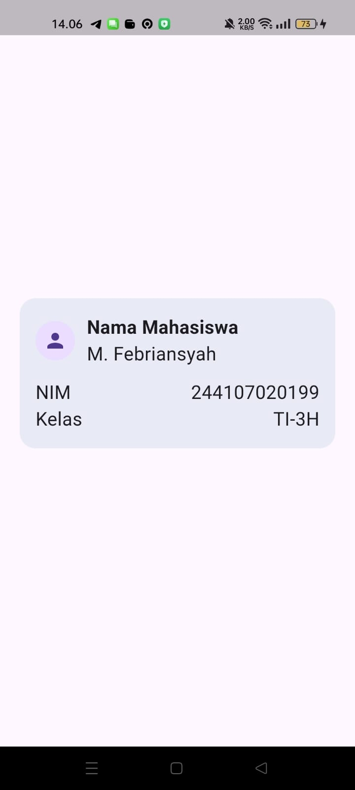
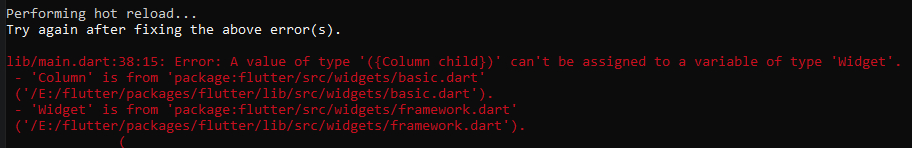
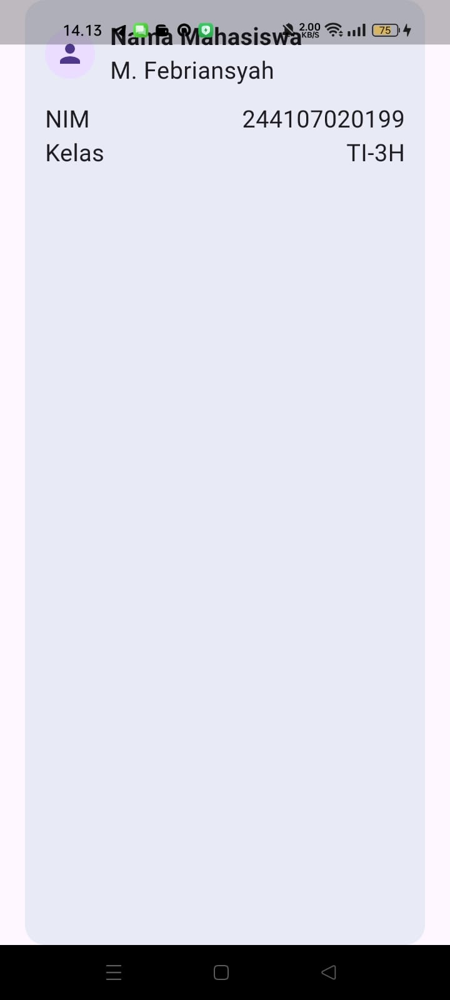
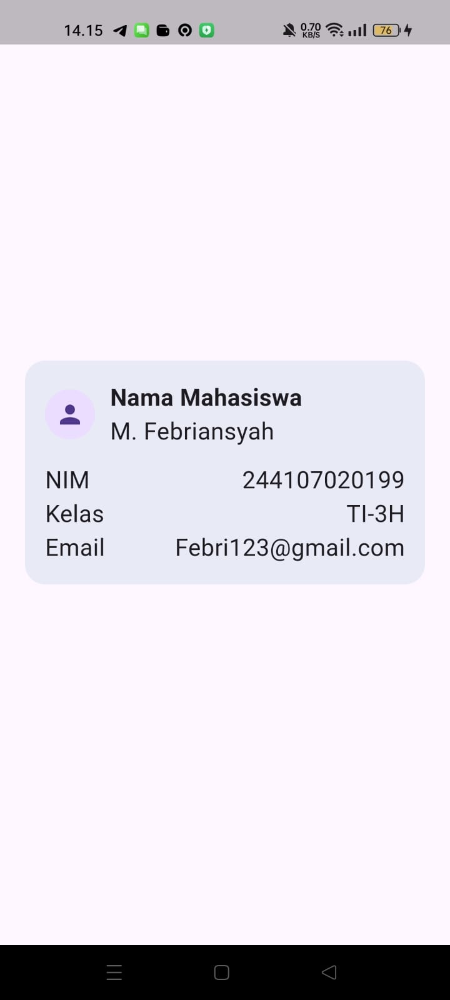
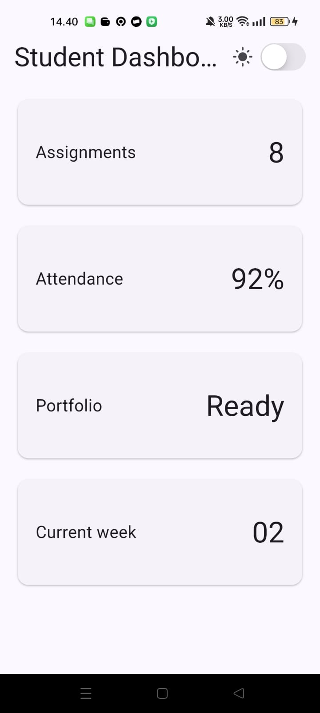
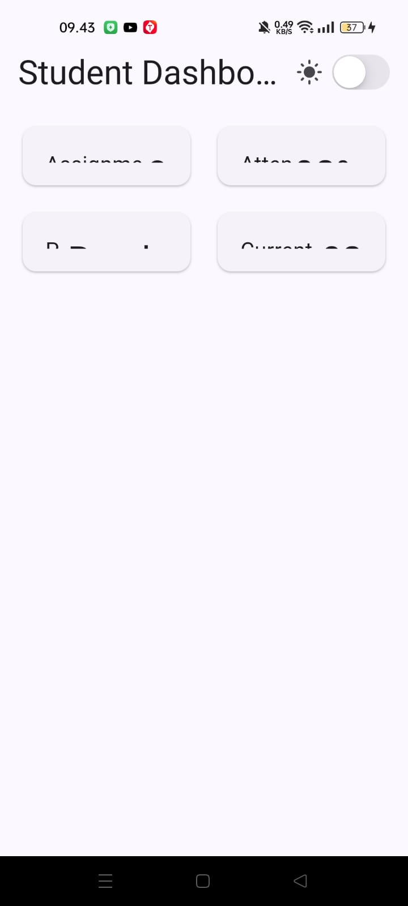
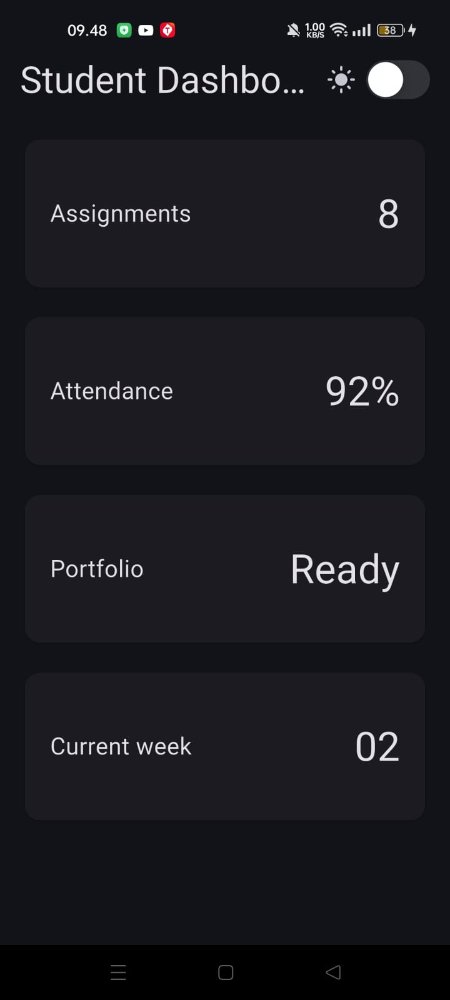
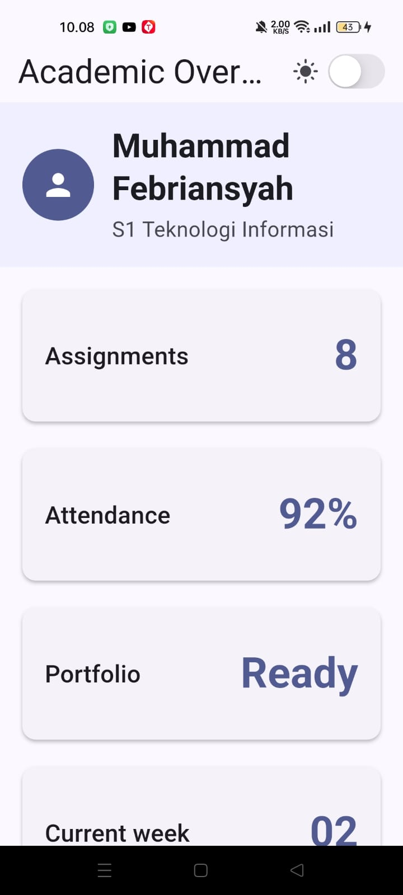
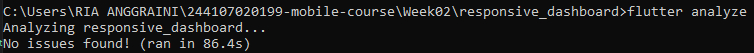

# 02 | Responsive Layout & State Management di Flutter

## Identitas Mahasiswa
* **Nama**: Muhammad Febriansyah
* **NIM**: [Isi dengan NIM kamu]
* **Mata Kuliah**: Pemrograman Mobile — Minggu 2
* **Program Studi**: S1 Teknologi Informasi

## Tujuan Praktikum
1. Memahami dan menerapkan *Responsive Layout* menggunakan `LayoutBuilder` dan `GridView`.
2. Mengelola *State* secara lokal menggunakan `StatefulWidget` untuk fitur *Dark Mode*.
3. Menerapkan elemen aksesibilitas menggunakan widget `Semantics` dan `MergeSemantics`.
4. Mengintegrasikan komponen desain Material dan Cupertino di dalam satu aplikasi.

---

## 4. Praktikum: Layout Sederhana (Warm-up)
Pada tahap ini, dilakukan pembuatan widget statis dasar menggunakan kombinasi `Container`, `Row`, `Column`, dan `Expanded` untuk membentuk sebuah Profile Card sederhana. Eksperimen dilakukan untuk memahami bagaimana `Expanded` membagi ruang, serta dampak dari `MainAxisSize` pada `Column`.

**Screenshot Praktikum 4 (Warm-up):** 

# Eksperimen warm-up
1. Hapus Expanded pada baris nama, lalu amati peringatan overflow atau perilaku layout-nya; kembalikan setelah itu.

Program menjadi error
2. Ganti mainAxisSize: MainAxisSize.min menjadi nilai default dan amati perubahan tinggi kartu.

3. Tambahkan satu baris data (misal Email) menggunakan pola Row + Expanded yang sama.

---

## 5. Praktikum: Dashboard Responsif
Mengubah aplikasi dari `StatelessWidget` menjadi `StatefulWidget` untuk mengelola status tema (*Light/Dark Mode*). Mengimplementasikan `CupertinoSwitch` pada `AppBar` dan menggunakan `LayoutBuilder` agar grid dashboard otomatis menyesuaikan jumlah kolom berdasarkan lebar layar (*breakpoint* 700px). Aksesibilitas juga ditingkatkan dengan membungkus elemen penting menggunakan `Semantics`.

> **Screenshot Praktikum 5 (Dashboard Responsif):**

Eksperimen layout
1. Ubah breakpoint dari 700 menjadi nilai lain dan amati perubahan jumlah kolom.

2. Ubah themeMode menjadi ThemeMode.dark, lalu kembalikan ke ThemeMode.system.

3. Uji aplikasi dengan ukuran layar emulator yang berbeda.

4. Tambahkan Semantics atau label yang bermakna pada elemen yang penting bagi screen reader.

---

## 6. Tugas Utama & AI Design Exploration
Melakukan *refactoring* dengan mengekstrak kartu informasi menjadi widget *reusable* (`InfoCard`), memindahkan *hardcoded style* menggunakan `Theme.of(context)`, dan menyatukan breakpoint ke dalam sebuah konstanta. Seluruh kode lolos uji `flutter analyze` (termasuk transisi dari `withOpacity` menjadi `withValues`) dan berhasil melewati `flutter test` untuk pengujian layar sempit dan lebar.

# Checklist verifikasi
1. flutter analyze tidak menghasilkan error.

2. flutter test lulus semua widget test responsif.

### Hasil Eksplorasi AI (Design Prompt Challenge)
* **Prompt:** "Bandingkan dua tata letak dashboard akademik untuk Flutter: versi GridView dan versi LayoutBuilder + Column. Jelaskan trade-off responsif dan aksesibilitasnya."
* **Hasil Analisis AI:** 
  * **GridView:** Sangat efisien dan mudah beradaptasi untuk item identik. Pembacaan *screen reader* sangat natural secara sekuensial. Kelemahannya adalah semua rasio kartu dipaksa sama (kurang cocok untuk teks yang panjangnya tidak seragam).
  * **LayoutBuilder + Column/Row:** Memberikan kontrol presisi (fleksibilitas) pada tiap tinggi/lebar elemen. Kelemahannya rawan *overflow* jika tidak di-*wrap* dengan SingleChildScrollView, dan *nesting* yang terlalu dalam dapat membingungkan navigasi *screen reader* tanpa manajemen yang tepat.

---

## Refleksi Praktikum

**1. Apa perbedaan cara berpikir imperative dan declarative saat membangun UI?**
* **Imperative:** Berfokus pada *"bagaimana"* cara mengubah UI. Developer harus memberikan instruksi manual satu per satu setiap kali ada perubahan (misal: `switch.setChecked(true)`, `teks.setColor(white)`).
* **Declarative:** Berfokus pada *"apa"* bentuk UI yang seharusnya ditampilkan berdasarkan kondisi (State) saat ini. Di Flutter, UI bersifat *immutable*. Ketika *state* (seperti `isDark`) berubah, Flutter otomatis menghancurkan UI lama dan membangun ulang (rebuild) seluruh UI baru yang sesuai dengan *state* tersebut tanpa perlu diinstruksikan satu-satu.

**2. Kapan Expanded membantu dan kapan penggunaannya justru menghasilkan layout error?**
* **Sangat Membantu:** Saat digunakan di dalam wadah yang memiliki batasan ukuran pasti (*bounded constraints*), seperti layar HP biasa. `Expanded` secara cerdas akan mengambil sisa ruang yang tersedia agar proporsi layout rapi.
* **Menghasilkan Error:** Saat ditempatkan di dalam wadah yang ukurannya tidak terbatas (*unbounded constraints*), contohnya di dalam `Row` yang dibungkus oleh `SingleChildScrollView` horizontal. `Expanded` akan mencoba meluas hingga tak terhingga sehingga memicu *error RenderFlex overflow*.

**3. Bagaimana breakpoint dan theme memengaruhi pengalaman pengguna?**
* **Breakpoint:** Membuat aplikasi nyaman digunakan di segala jenis perangkat. Pengguna HP tidak kesulitan membaca karena konten dibuat memanjang (1 kolom), sedangkan pengguna Web/Tablet tidak melihat ruang kosong yang terbuang percuma (2 kolom).
* **Theme (Dark/Light):** Mengurangi kelelahan mata pengguna (*eye strain*) terutama saat menggunakan aplikasi di ruangan gelap, serta menghadirkan nuansa visual yang konsisten dan elegan secara otomatis.

**4. Apa yang Anda verifikasi dari rekomendasi AI setelah tugas inti selesai?**
Saya memverifikasi tiga hal utama dari kode dan rekomendasi AI:
1. **Responsivitas:** Menguji langsung pada ukuran layar di atas dan di bawah angka `kWideBreakpoint` (700px) untuk memastikan layout `GridView` benar-benar berubah jumlah kolomnya.
2. **Kualitas Aksesibilitas:** Memastikan penggunaan `MergeSemantics` dan pembacaan *label* kustom tidak merusak struktur widget, melainkan membungkus `Icon` dan `CupertinoSwitch` menjadi satu kalimat utuh yang ramah bagi penyandang disabilitas.
3. **Kepatuhan *Clean Code*:** Menjalankan `flutter analyze` untuk mengaudit kode AI. Saat ada peringatan penggunaan `.withOpacity()` yang *deprecated*, saya langsung memverifikasi perbaikannya menjadi `.withValues(alpha: ...)` hingga kode bersih dari *warning*.