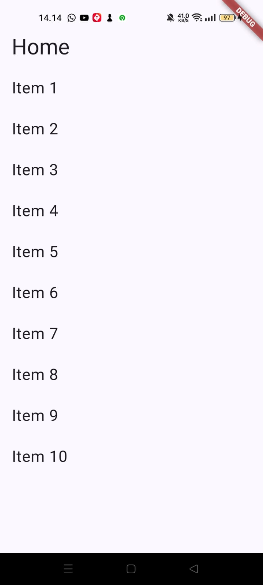
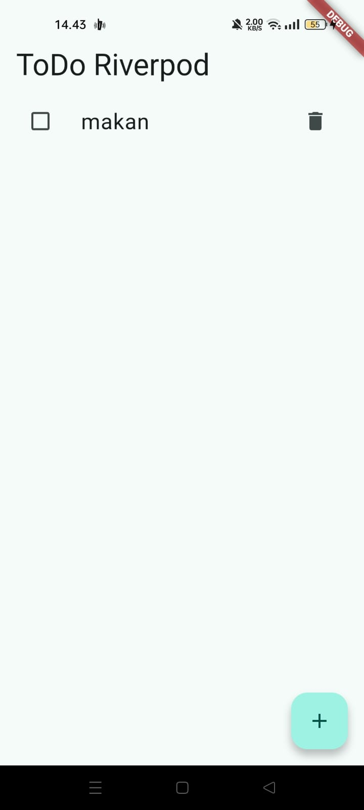
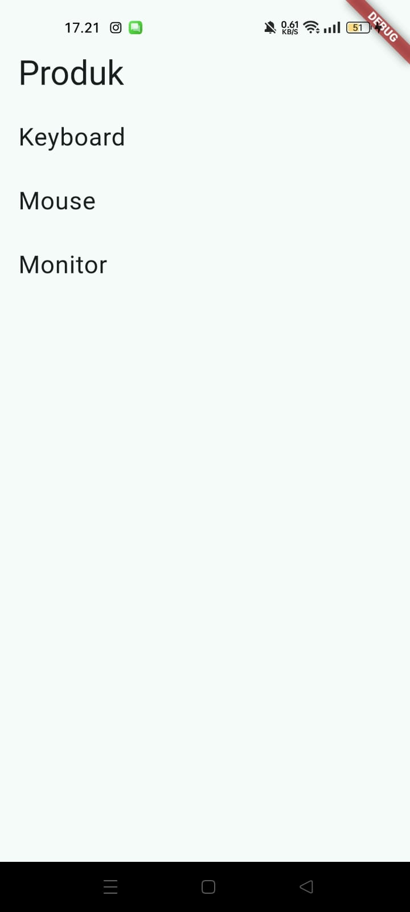
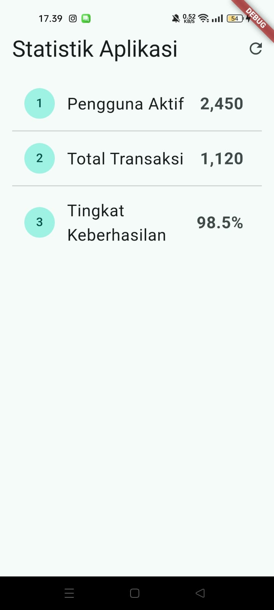
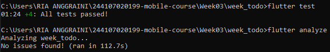

# 03 | Navigation & State Management di Flutter

## Identitas Mahasiswa
* **Nama**: Muhammad Febriansyah
* **NIM**: 244107020199
* **Mata Kuliah**: Pemrograman Mobile — Minggu 3
* **Program Studi**: S1 Teknologi Informasi

## Tujuan Praktikum
1. Menjelaskan konsep navigasi, route, dan perbedaan Navigator 1.0 dengan GoRouter.
2. Menerapkan navigasi multi-page dengan GoRouter, termasuk passing argument dan deep link sederhana.
3. Menjelaskan mengapa state management diperlukan dan cara kerja Riverpod (Provider, ConsumerWidget, Notifier).
4. Menggunakan AsyncValue untuk menangani state loading, error, dan success pada UI.
5. Membangun aplikasi ToDo dengan navigasi dan Riverpod, lalu memverifikasi hasilnya dengan widget test sederhana.

---

## 1. Praktikum: Aplikasi Multi-page dengan GoRouter
Pada tahap ini, dilakukan implementasi navigasi deklaratif menggunakan GoRouter untuk menggantikan Navigator 1.0. Konfigurasi router dibuat terpusat di main.dart melalui MaterialApp.router. Eksperimen dilakukan dengan membuat navigasi dari HomePage ke DetailPage sambil mengirimkan path parameters (id) dan menguji fitur deep link langsung ke path /detail/1.

**Screenshot Praktikum 1 (GoRouter Home & Detail):**

---

## 2. Praktikum: Aplikasi ToDo dengan Riverpod
Mengubah pengelolaan state bawaan menjadi terpusat menggunakan Riverpod agar state dapat dibagikan lintas halaman. Praktikum ini mencakup pembuatan NotifierProvider dan penerapan ConsumerWidget pada antarmuka.

**Screenshot Praktikum 2 (Riverpod ToDo List):**

### Eksperimen Riverpod

1. Menerapkan immutabilitas pada TodoListNotifier menggunakan method `.copyWith()` pada model data agar UI dapat ter-rebuild secara konsisten.
2. Menggunakan `ref.watch()` di dalam method `build` untuk berlangganan perubahan, dan `ref.read()` di dalam fungsi callback (seperti `onPressed`) untuk memodifikasi daftar tanpa melakukan rebuild yang tidak perlu.

---

## 3. Praktikum: Uji Ketiga State (AsyncValue)
Menerapkan AsyncNotifier untuk mengelola state yang berasal dari proses asinkron (seperti membaca database/API). State diolah secara aman tanpa risiko bentrok menggunakan tipe data AsyncValue.

**Screenshot Praktikum 3 (State Loading, Error, Success):**

### Eksperimen AsyncValue

1. Memodifikasi method `build()` untuk melempar `Exception` dan menguji tampilan ketika error terjadi (ditangkap oleh `AsyncValue.guard`).
2. Menekan tombol **Coba lagi** yang memicu `ref.invalidate` atau `.refresh()`, mengembalikan UI ke kondisi loading sebelum akhirnya berhasil memuat data (success).

---

## 4. Tugas Utama & AI Design Exploration
Melakukan refactoring aplikasi ToDo secara menyeluruh:

1. Mengekstrak tampilan baris menjadi widget terpisah (`TodoTile`).
2. Menambahkan fitur filter (Semua, Aktif, Selesai) menggunakan Provider Turunan.
3. Menerapkan ShellRoute dari GoRouter agar aplikasi memiliki NavigationBar (Bottom Nav) yang konsisten saat berpindah dari halaman ToDo ke halaman Statistik.

**Screenshot Tugas Utama (Todo Filter & Stats Page via Bottom Nav):**

### Checklist Verifikasi
1. Navigasi GoRouter bekerja sempurna: pindah tab, back button, dan akses path langsung.
2. ProviderScope membungkus root aplikasi; state ToDo tidak hilang ketika berpindah tab.
3. UI AsyncValue berhasil menangani loading, error, dan success secara deklaratif dengan `.when()`.
4. `flutter analyze` berjalan tanpa isu (No issues found!) dan `flutter test` lulus 100% (All tests passed!).

**Screenshot Bukti Verifikasi (Terminal):**

### Hasil Eksplorasi AI (AI Prompt Challenge)
* **Prompt:** "Buatkan halaman Flutter bernama StatsPage menggunakan flutter_riverpod. Requirements: ConsumerWidget dengan satu AsyncNotifierProvider yang mensimulasikan pengambilan data statistik (delay 2 detik, kadang gagal 30%). UI harus menangani loading, error, success. Berikan unit test untuk notifier-nya."

### Hasil Analisis & Perbaikan Kode AI

1. **Pola AsyncValue:** Kode AI berhasil membuat pola AsyncValue lengkap dengan penanganan 3 status secara eksklusif (tidak memakai boolean terpisah).
2. **Perbaikan teknis:** AI pada awalnya meletakkan file test di dalam folder `lib/`, yang mana menyalahi aturan struktur Flutter. Saya memperbaiki lokasinya ke folder `test/`.
3. **Perbaikan unit test:** Terjadi `TimeoutException` dan error Provider disposed pada test runner karena Riverpod menghentikan provider selama masa tunggu (delay). Saya memperbaikinya dengan menyisipkan `container.listen(statsProvider, (previous, next) {})` agar provider tetap hidup di memori selama proses asinkron di dalam unit test berlangsung.

---

## Refleksi Praktikum

**1. Kapan `setState` masih cukup, dan kapan state harus naik ke Riverpod?**

* **`setState` cukup:** Saat mengurus data UI lokal yang sangat sederhana dan hanya berefek pada satu widget tersebut (contoh: membuka/tutup dropdown, visibilitas password, animasi sesaat).

* **Naik ke Riverpod:** Saat state perlu diakses lintas halaman (prop drilling), perlu dipertahankan meski rute halaman hancur/berganti, atau saat memisahkan logika dari UI agar bisa dilakukan unit testing.

**2. Apa perbedaan `context.go` dan `context.push`, dan kapan masing-masing tepat digunakan?**

* **`context.go`:** Menggantikan URL/route saat ini tanpa menambah tumpukan riwayat. Ideal untuk perpindahan navigasi root tingkat tinggi seperti antar tab di NavigationBar atau rute redirect setelah proses login.

* **`context.push`:** Menumpuk halaman baru di atas halaman yang sedang aktif. Sangat cocok untuk masuk ke sub-halaman (seperti DetailPage) agar pengguna tetap bisa menggunakan tombol Back sistem untuk kembali ke halaman sebelumnya.

**3. Bagaimana `AsyncValue` mencegah bug dibanding tiga boolean terpisah?**
Jika menggunakan tiga boolean independen (isLoading, isError, hasData), sistem rentan terhadap inkonsistensi (bug), seperti isLoading = true dan isError = true terjadi bersamaan karena gagal me-reset state. AsyncValue menggunakan konsep discriminated union, di mana state dipaksa hanya boleh memiliki satu dari tiga kondisi absolut (loading, error, atau data) pada satu waktu yang sama.

**4. Bagian mana dari hasil AI yang Anda perbaiki, dan mengapa?**
Saya memperbaiki letak struktur direktori file test dari `lib/` ke `test/`, dan secara krusial menambahkan listener dummy pada `ProviderContainer` di dalam blok unit test. Hal ini mutlak diperlukan karena lingkungan pengujian Riverpod secara otomatis menghancurkan (dispose) sebuah provider jika tidak ada widget/proses yang secara aktif "mendengarkan" perubahannya di tengah berjalannya waktu jeda (delay asinkron).